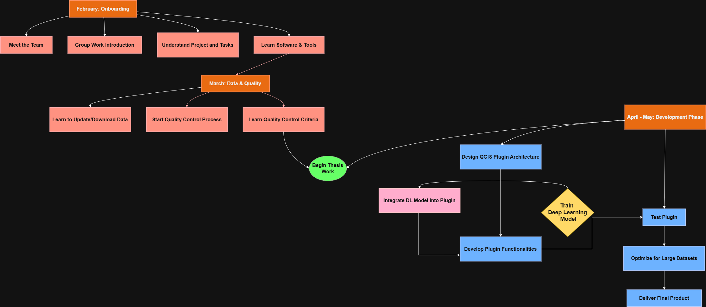
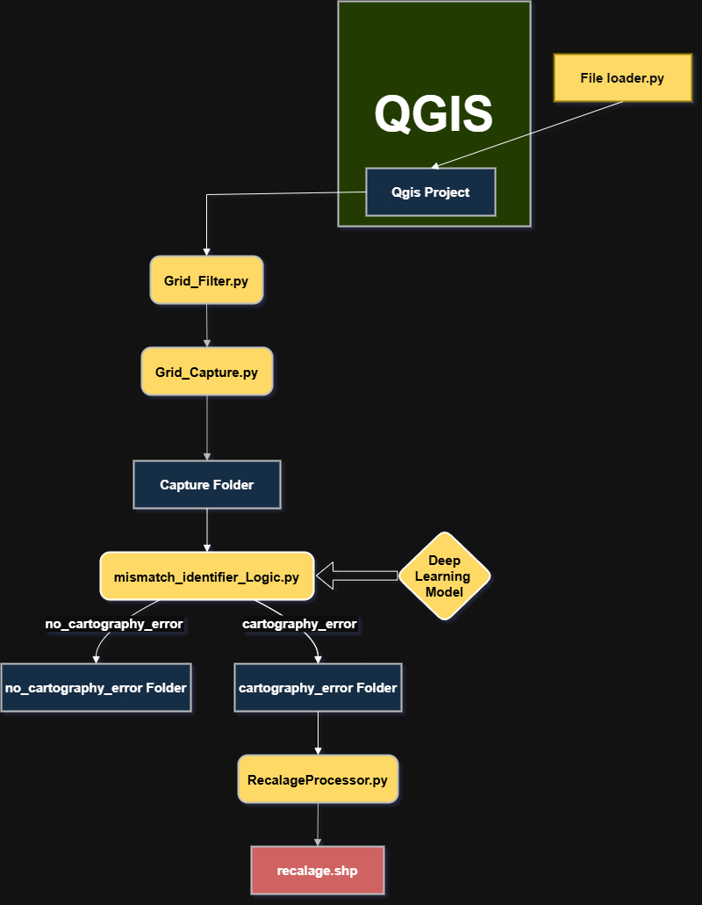
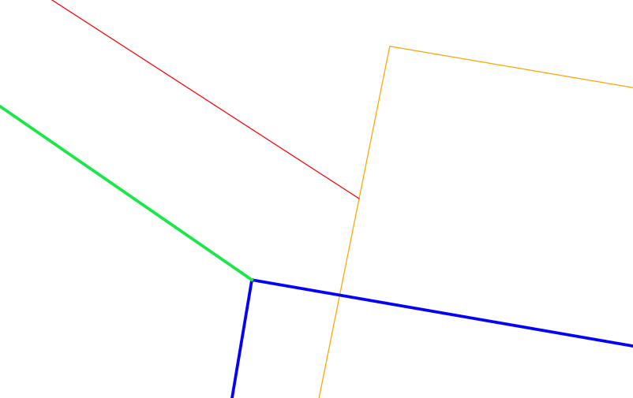
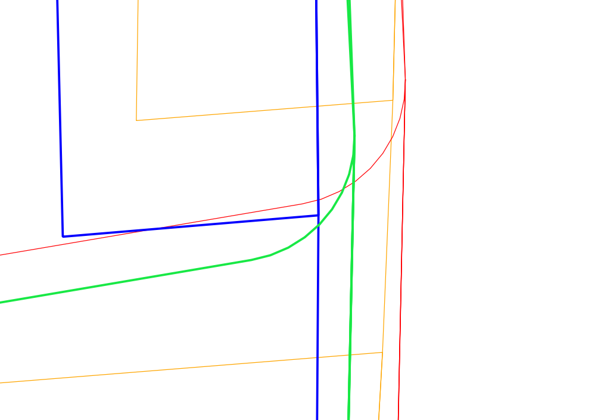

# 🛰️ Mismatch Identifier Plugin for QGIS

This plugin was developed as part of my Master’s thesis in Geomatics. It allows automated detection and processing of cartographic mismatches in a grid-based QGIS project using deep learning and image classification.

## 📌 Overview

The Mismatch Identifier Plugin automates a pipeline involving:

1. **Grid filtering and capture from QGIS layers**
2. **Image-based error detection using a deep learning model**
3. **Automatic classification into "cartography error" and "no cartography error"**
4. **Recalage (alignment correction) processing for error regions**
5. **Final output as a Shapefile (`recalage.shp`)**


###  Thesis and plugin development journey 

Below is a simplified flow diagram of Thesis and plugin development journey:

 <!-- Replace with your image after upload -->

###  Architecture

Below is a simplified flow diagram of the plugin components:

 <!-- Replace with your image after upload -->

---

###  cases of work 

Below is a case of errors the plugin can identify :

 <!-- Replace with your image after upload -->


---

## 🔧 Installation Guide

### 1. Clone the Repository

```bash
git clone https://github.com/SayehOmar/Mismatch_Identifier_Plugin.git
